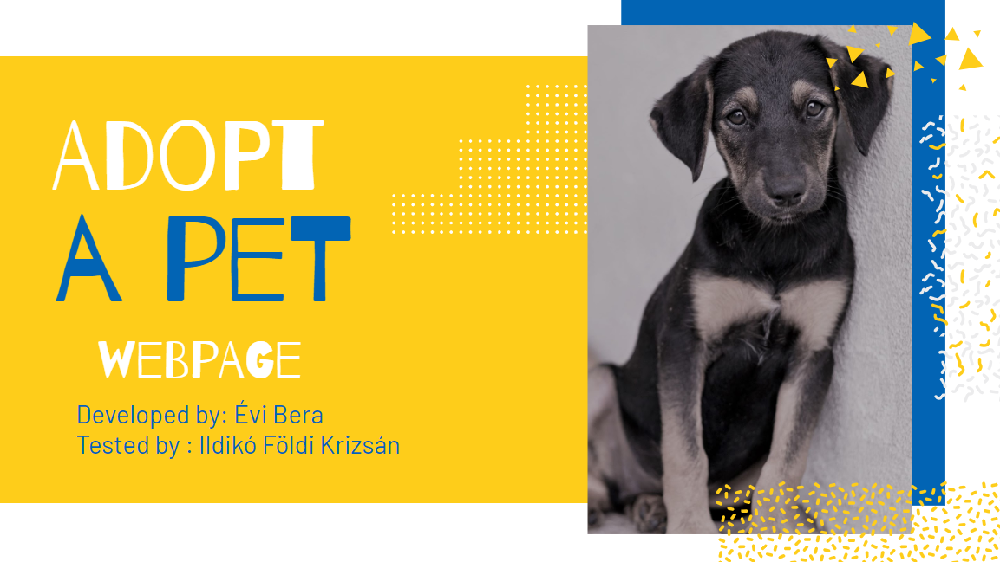

The project being tested can be found at the following link: https://github.com/EviBera/adopt-a-pet.
The application was developed by

[](https://github.com/EviBera)

The tests were created by

[](https://github.com/FoldiKrizsanIldiko)

## About The Project

This project is an application created for an animal shelter. Through the app, users can browse animals and express their interest in adopting. 
The shelter team has different access permissions, allowing them to upload new data and review adoption requests. 
Additionally, there is a third type of user with administrative rights, who has elevated control over the platform.

You can download the project with :
```angular2html
git clone https://github.com/EviBera/adopt-a-pet
```
Please checkout to branch: 
```angular2html
git checkout rescue-team-features
```
You have to run a database locally :
```angular2html
docker run -e POSTGRES_PASSWORD=password -e POSTGRES_DB=AdoptAPet -p 5433:5432 -d postgres
```
You can start your database from Docker Desktop application or do it from terminal:
```angular2html
docker ps -a // list all your containers and find the PostgreSQL container you created previously
docker start <'container_name_or_id'>
```
In backend/AdoptAPet/appsettings.json file change the "DefaultConnection": "Host=localhost;Port=5433;Database=AdoptAPet;Username=postgres;Password=<Your password>;TrustServerCertificate=True"

Start the backend:

```angular2html
cd .\backend\AdoptAPet
dotnet run
```
You can check your backend on http://localhost:5028/swagger

Run the frontend:

```angular2html
 cd .\frontend\AdoptAPet\
ng serve -o
```
Now the page should open in your browser http://localhost:4200/adopt



