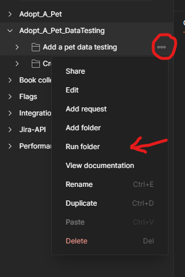
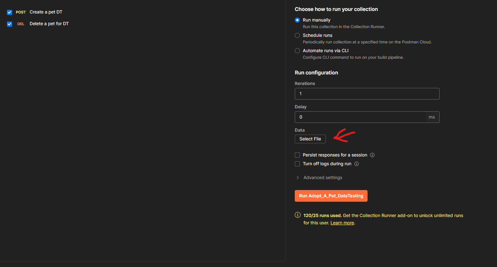

#### adoptAPet

In Postman, you can run the Adopt_A_Pet collection.  It uses the local server, tesing the APIs on http://localhost:5028.

# **STEPS for running local server:**

1. Clone the repository:

   http:://github.com/EviBera/adopt-a-pet
2. Run the database in Docker:

   docker run -e POSTGRES_USER=postgres -e POSTGRES_PASSWORD=password -e POSTGRES_DB=mydatabase -p 5433:5432 -d postgres

   If you want, replace the username and password with your own.
3. Run these commands for migration:

   dotnet ef migrations add  InitialMigrationAtIldi
   dotnet ef database update
   dotnet ef migrations list
4. Update the "appsettings.json" file :

   "DefaultConnection": "Host=localhost;Port=5433;Database=AdoptAPet;Username=postgres;Password=password;TrustServerCertificate=True"

   Replace username and password with you own.
5. Run the backend:

   cd in Backend\AdoptAPet

   dotnet run

# **For running Data tests in Postman:**

Open Adopt_A_Pet_DataTesting collection. You can run tests for POST requests separately:

for creating pets:

It will open the Runner, where you should add the file with data for tests :

After that click Run, and all tests will be executed.
